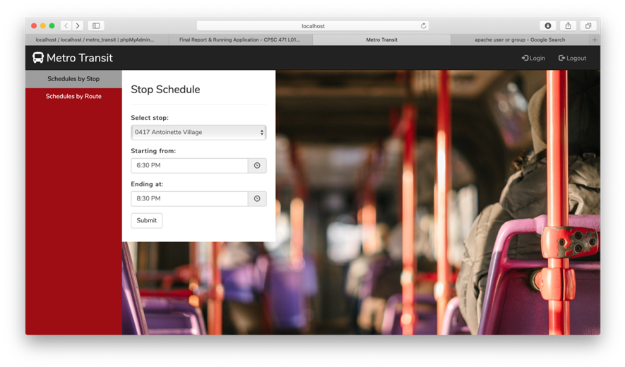
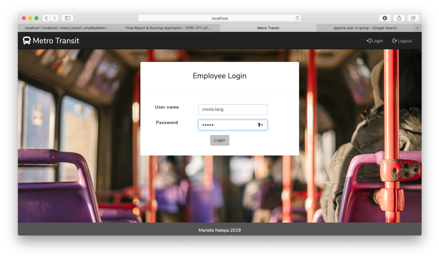
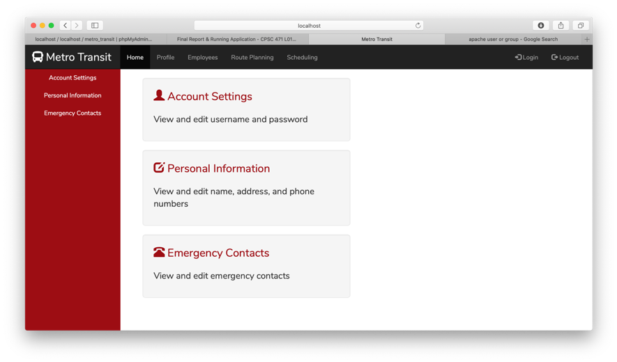
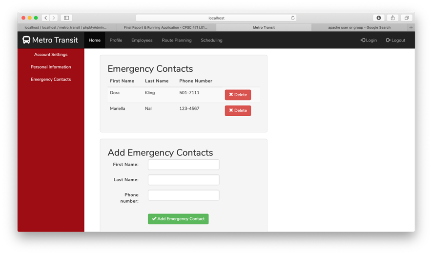
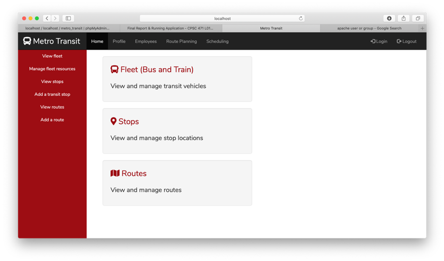
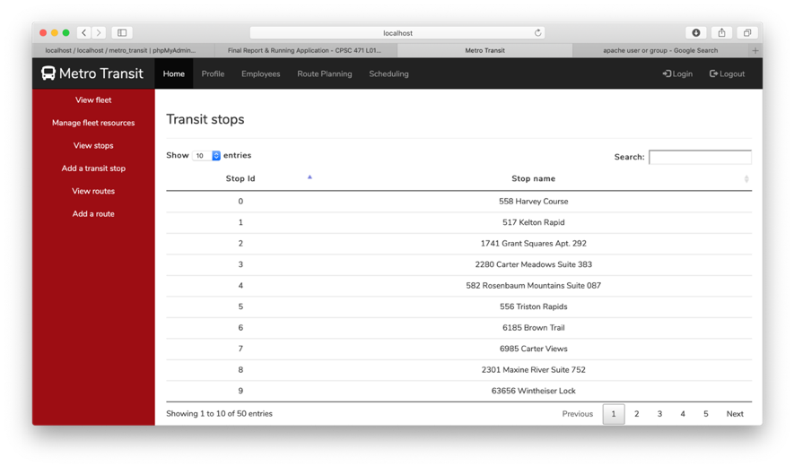

# Metro Transit
## Data Base Management Systems Project
Database web application completed as part of coursework for an introductory relational databases course. Students were required to build either a desktop or web application backed by a database designed on a chosen problem. I had no experience with any sort of web development but chose to jump in with both feet (I don't necessarily advise this). 

The application was built on an AMP (Apache-MySQL-PHP) stack using the Laravel PHP framework to facilitate development in the MVC (Model-View-Controller) pattern. Laravel brings together various components to make authenication, routing, sessions, and database interactions easier. Bootstrap was used for front-end web design.

The project was meant to imitate a rudimentary public transit management system wherein the web portal would provide:
1. Public access to trip planning resources, such as route and stop schedules, 
2. Scheduling from a Human Resources perspective: the assignment of transit resources – fleet vehicles and vehicle operators – to instances of established transit routes, and
3. Self-management of employee profiles, including login credentials, contact information, and emergency contacts.

The database was populated with dummy data using random data generator tools. 

The first 40% of the project grade was devoted to the conceptual and functional design of the database system, including creation of an ERD (Entity-Relationship Diagram) and relational schema as well as data flow diagrams for the system (HIPO and DFD). The turnaround on the app portion of the project was tight (three weeks from relational model to functional design, two weeks from design to full delivery of the app).

  
  
  
  
  
  

