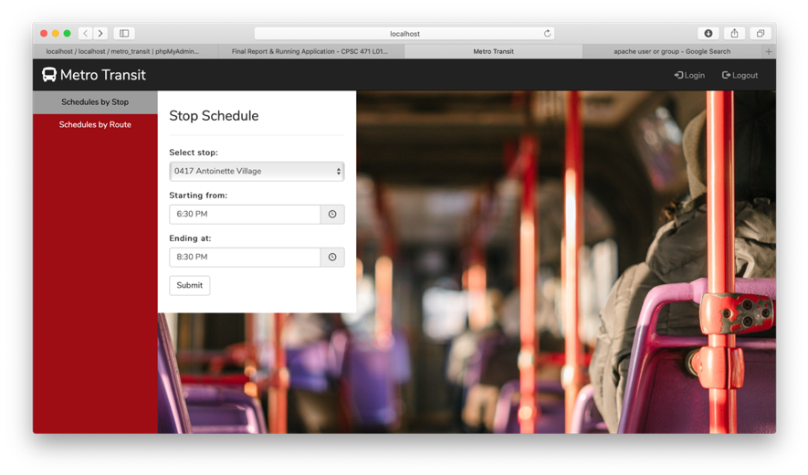

# CPSC-471
## Data Base Management Systems Project
Database web application completed as part of coursework for an introductory relational databases course. The project was completed solo for 30% of the course's final grade, and was my first exploration into web app development. 
The application was built on an AMP (Apache-MySQL-PHP) stack using the Laravel PHP framework to facilitate development in the MVC (Model-View-Controller) pattern. 

The project was meant to imitate a rudimentary public transit management system wherein the web portal would provide:
1. Public access to trip planning resources, such as route and stop schedules, 
2. Scheduling from a Human Resources (HR) perspective: the assignment of transit resources – fleet vehicles and vehicle operators – to instances of established transit routes, and
3. Self-management of employee profiles, including login credentials, contact information, and emergency contacts.

The database was populated with dummy data using random data generator tools. 

The first 40% of project was devoted to the conceptual and functional design of the database system, including creation of an ERD (Entity-Relationship Diagram) and relational schema as well as data flow diagrams for the system (HIPO and DFD). 

